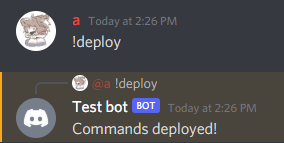

SLASH-HANDLER
-------------

This package is a command handler for discord bots made with discord.js v13.

(For slash commands to work, your bot needs the `applications.commands` OAuth2 scope, which you can enable in the [OAuth2 tab of your application.](https://discord.com/developers/applications)

It includes support for:
- slash commands
- sub-commands and sub-command groups
- buttons
- select menus
- basic permissions

### Installation

Currently, the package isn't published on npm, so you have to install it manually.

Grab the latest package version from [the releases tab,](https://github.com/DronePC/slash-handler/releases) and install it in your Node.js project by using the path of your downloaded file.
```shell
npm i discord.js "path/to/slash-handler-0.4.x.tgz"
```
*(Note: you can omit `discord.js` if you already have it installed.)*


### Basic command handling

*TypeScript is recommended for using this package, but you can continue with base JavaScript.*

To start using the command handler, you must create a `CommandHandler` class, and register a `Command` class to it.

```typescript
// Import dependencies
import { Client } from 'discord.js'
import { CommandHandler, Command } from 'slash-handler'

// Declare client with intents
const client = new Client(/* options here...*/)

// Declare command handler
const handler = new CommandHandler({
    // Client for which commands will be handled
    client,
    // Options for deploying commands in a guild,
    // your id is required if commands will be deployed
    // by a message command
    deployOptions: {
        allowedUserIds: your_id
    }
})

// Declare command
const cmd = new CommandGroup({
    // Name and description that will show up in the
    // slash command menu, both are required 
    name: "ping",
    description: "Ping!",
    // Code of the slash command, must be asynchronous
    run: async (interaction) => {
        // Replies to the command
        interaction.reply("Pong!")
    }
})

// Commands have to be registered manually,
// for automatically registering commands see the next guide
handler.registerCommand(cmd)

// Login the client
client.login(your_token);
```

*Using CommonJS? You can exchange the ES imports to CommonJS ones.*
```javascript
// Using CommonJS imports
const { Client } = require('discord.js')
const { CommandHandler, Command } = require('slash-handler')
// The rest stays the same
```

After running the bot, you may notice that the commands don't show up in your server. This is because they aren't deployed, to do so you can send a message command (defaults to `!deploy`) in the server you want the commands in.



Now your command should appear in the slash command picker for that server.


Congratulations! Now you can make basic commands with the command handler.
